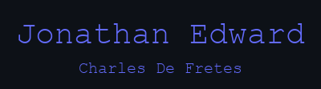

 
 
<h4 align="center">
  An Electrical Engineering student at the <a href="https://www.ui.ac.id/en/universitas-indonesia/">University of Indonesia</a>, 
   passionate about both software and hardware development, 
   with a deep interest in **machine learning** and **IoT**.
</h4>

   

  
  <h5>Success is the sum of small efforts, repeated day in and day out. – Robert Collier</h5>

   

  <h1></h1>

<h3 align="center">👨‍💻 Programming and Markup Languages</h3>

    
    
    
    
    
    
    
    
    
    
     
    
    
    
    
    
    

 
<h3 align="center">🧰 Frameworks and Libraries</h3>

    
    
    
    
    
    
     
    
    

 
<h3 align="center">🗄️ Databases and Cloud Hosting</h3>

    
    
    
    

 
<h3 align="center">💻 Software and Tools</h3>

    
    
    
    
    
    
    
     
    
    

<h1>My Contacts</h1>
* 🎮 Discord   : atlasjr.
* 🧑‍🎓 LinkedIn  : <a href="https://www.linkedin.com/in/jonathanedw05">Jonathan Edward</a>

         

<h5>Thanks for seeing my profile.  Currently moving some projects to Github.</h5>